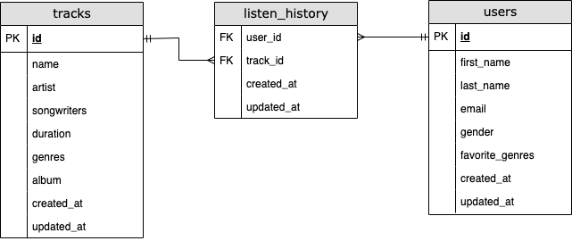

# Réponses du test

## _Utilisation de la solution (étape 1 à 3)_

_Inscrire la documentation technique_

1. Créer un environnement virtuel:

```
python3.12 -m venv .venv
```

2. Activer de l'environnement virtuel:

```
source .venv/bin/activate
```

3. Installer les dépendances:

```
pip install -r requirements.txt
```

4. Pour lancer le serveur de l'application, naviguez vers `src/moovitamix_fastapi/` et exécutez:

```
python -m uvicorn main:app
```

5. Pour lancer le flux de données, naviguez vers `src/pipeline/` et exécutez:

```
python main.py
```

Après l’extraction et la transformation, le flux de données enregistre les données localement dans `src/pipeline/data/`.

6. Pour exécuter les test unitaires, naviguez à la racine du projet et exécutez [^1]:

```
pytest
```

[^1]: Selon votre configuration, vous devrez peut-être exécuter la commande suivanate à la place: `python -m pytest`

## Questions (étapes 4 à 7)

### Étape 4

Les données extraites des trois endpoints — c’est-à-dire tracks, users et listening history — par le flux de données sont déjà assez structurées et fortement reliées entre elles. Par conséquent, un système SQL s’impose naturellement, contrairement à une solution NoSQL (même si cette dernière peut jouer un rôle intéressant, notamment dans les contextes à fort volume d’écriture).

Le pipeline effectue également une transformation de type flattening sur l’historique d’écoute afin d’en faciliter le chargement dans une base de données ou l’analyse en aval. Le schéma résultant est le suivant :



J’ai choisi de conserver une structure relativement dénormalisée, car elle sera probablement utilisée dans un contexte axé sur l’analyse, notamment par les scientifiques de données ou analystes qui travailleront à raffiner le modèle de recommandation. Une telle approche — adaptée aux charges de lecture élevées — permet également d’écrire des requêtes plus simples, avec moins de jointures.

Enfin, pour ce qui est du système de base de données recommandé, je choisirais PostgreSQL pour un pipeline prêt pour la production, compte tenu de la richesse de ses fonctionnalités SQL, de ses performances dans les charges analytiques et de sa capacité à évoluer pour gérer les volumes de données typiques d’une application comme Spotify.

### Étape 5

Comme pour de nombreux systèmes backend, la mise en place de logs hiérarchisés et d’alertes est essentielle afin de détecter rapidement toute anomalie ou défaillance. Voici l’approche générale que je proposerais :

1. Comme première étape, je mettrais en place un système de surveillance avec des outils comme Prometheus pour collecter et exposer les métriques clés, et Grafana pour les visualiser dans un tableau de bord.

2. En cas de conditions anormales — par exemple, une hausse soudaine des échecs ou l’absence de données traitées — je configurerais des alertes afin d’être notifié immédiatement de tels événements (par email, Slack, etc.).

3. Enfin, la prévention est le meilleur remède : le pipeline lui-même devrait intégrer des mécanismes de gestion d’erreurs avancés afin de fonctionner de manière aussi autonome que possible. Par exemple, si certaines requêtes HTTP échouent, le pipeline devrait inclure une logique de retraitement intelligent (retries) afin de maximiser les chances de collecter et de traiter les données attendues.

Parmi les métriques clés à surveiller :

- Le temps d’exécution du pipeline ETL (moyenne/min/max sur les 3 derniers jours, 1 semaine, 1 mois, etc.)
- Le temps d’exécution de chaque étape ETL (extraction, transformation, chargement)
- Le taux de réussite/échec des requêtes API
- Le nombre d’entrées traités par le pipeline
- L'utilisation de: CPU, RAM, I/O.
- La latence des opérations I/O (requêtes API, accès base de données)

### Étape 6

Avant d'automatiser le calcul des recommandations, les données ingérées par le pipeline de données doivent d'abord être agrégées pour produire des structures de données optimisées pour la génération de recommandations — par exemple, les interactions utilisateur-chanson telles que le nombre total de lectures, leurs durées et la fréquence des lectures au fil du temps. Ces structures peuvent ensuite être alimentées dans le modèle de recommandation pour générer de nouvelles recommandations, qui sont ensuite stockées dans une base de données à faible latence ou un cache. Pour automatiser ce processus, un outil de planification ou d'orchestration comme Airflow ou Prefect peut être utilisé pour exécuter le flux de travail, soit en quasi-temps réel, soit par lots, en fonction de la latence souhaitée et des contraintes en ressources.

### Étape 7

De manière similaire, avant d'automatiser le réentrainement du modèle, les données ingérées par le pipeline doivent être transformées en ensembles de données d'entraînement. Un outil d'orchestration doit ensuite être configuré pour déclencher le code d'entraînement du modèle en utilisant ces ensembles de données. Le modèle résultant est d'abord évalué par rapport à une référence, et s'il atteint les seuils de performance, il peut être déployé automatiquement dans un environnement de mise en production ou de staging. Enfin, les exécutions de réentrainement, les métriques associées et les artefacts du modèle doivent être suivis dans un registre de modèles pour garantir la reproductibilité et la traçabilité.